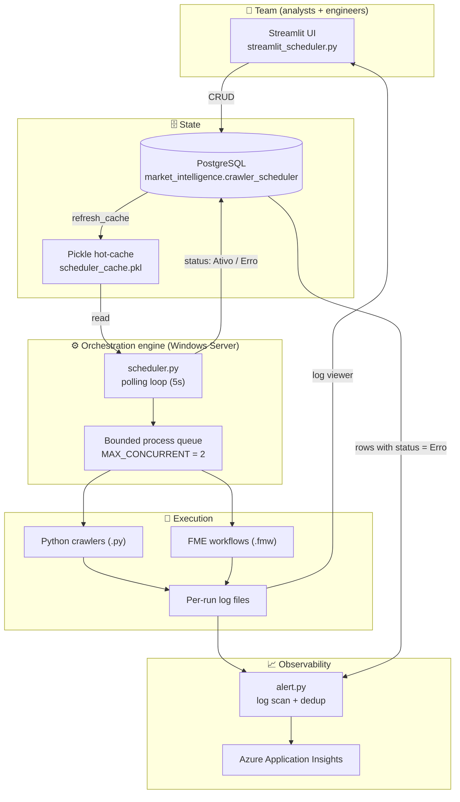
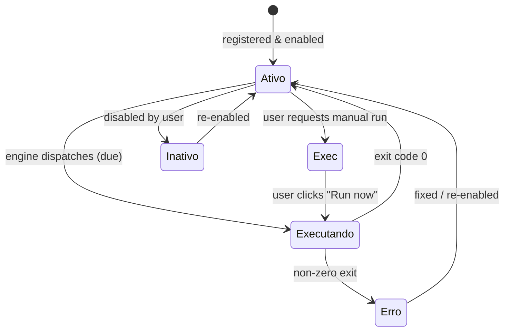

# Crawlers Scheduler — a zero-cost, self-hosted orchestrator for FME & Python

> A lightweight orchestration and monitoring platform that gives a data team the parts of **Apache Airflow** it actually needed — scheduling, execution, retries-by-status, centralized logging and team-wide observability — **without the infrastructure, licensing or operational cost** of a full orchestrator.

**Idealized, designed and built by Rodrigo Almeida.** What started as a small "schedule a few FME flows from a spreadsheet" utility grew, by deliberate iteration, into the backbone that runs the team's entire crawler fleet — today orchestrating **both FME workflows (`.fmw`) and Python crawlers (`.py`)** side by side.

---

## Table of contents

- [Why this exists](#why-this-exists)
- [The hard part: rebuilding Airflow's value without Airflow](#the-hard-part-rebuilding-airflows-value-without-airflow)
- [Architecture](#architecture)
- [How the engine works](#how-the-engine-works)
- [The scheduling model](#the-scheduling-model)
- [The status state machine](#the-status-state-machine)
- [Observability & alerting](#observability--alerting)
- [The team-facing UI](#the-team-facing-ui)
- [Data model](#data-model)
- [Engineering challenges solved](#engineering-challenges-solved)
- [Tech stack](#tech-stack)
- [Running it](#running-it)
- [Design trade-offs & honest limitations](#design-trade-offs--honest-limitations)
- [Roadmap](#roadmap)

---

## Why this exists

The team maintains a **growing fleet of ~30 data crawlers** — some authored in [FME](https://www.safe.com/) by analysts, others written in Python by engineers. They feed a PostgreSQL data warehouse that powers downstream Market Intelligence & Research work.

As the fleet grew, three problems appeared at once:

1. **Scheduling was manual and tribal.** Each flow ran off someone's machine, a lone Task Scheduler entry, or by hand. There was no single place that answered *"what runs, when, and did it succeed?"*
2. **There was no shared visibility.** When a crawler broke, nobody knew until the data was stale. Failures were invisible to the rest of the team.
3. **The obvious tool didn't fit.** Apache Airflow (or Prefect, Dagster, Jenkins) is the textbook answer — but it assumes a Linux host, a container/scheduler infrastructure, an engineering team to babysit the DAGs, and budget. In this context (a **Windows Server**, no dedicated platform budget, and **non-engineer teammates who need to register their own flows**), standing up Airflow would have cost more to run than the crawlers it managed.

So the goal became explicit: **reproduce the 20% of an orchestrator that delivered 80% of the value**, on the infrastructure we already had, at zero licensing cost, and make it usable by people who don't write code.

---

## The hard part: rebuilding Airflow's value without Airflow

An orchestrator looks simple until you build one. Airflow ships years of solved problems for free; doing it yourself means re-deriving each one. This project deliberately re-implemented the subset that mattered:

| What Airflow gives you | What had to be built here | Where it lives |
|---|---|---|
| A scheduler that fires tasks on a cadence | A polling engine with per-frequency due-date logic (daily / weekly / monthly / semiannual / manual) | [`scheduler.py`](crawlers_scheduler/scheduler.py) |
| Executors with parallelism limits | A bounded process queue (`MAX_CONCURRENT`) that spawns and reaps OS subprocesses | [`scheduler.py`](crawlers_scheduler/scheduler.py) |
| Task state & retry semantics | A `status` state machine (`Ativo → Executando → Ativo/Erro`, plus `Exec` for manual runs) persisted in PostgreSQL | [`controller.py`](crawlers_scheduler/controller.py) |
| Per-task logs in the UI | Per-run isolated log files + an in-app log viewer with tail & error filtering | [`streamlit_scheduler.py`](crawlers_scheduler/streamlit_scheduler.py) |
| Metadata database | A PostgreSQL table + a pickle **hot-cache** so the tight loop never hammers the DB | [`schema.py`](crawlers_scheduler/schema.py) |
| Alerting / monitoring | Log scanning, error extraction, fingerprint de-duplication and **Azure Application Insights** telemetry | [`alert.py`](crawlers_scheduler/alert.py) |
| A DAG authoring interface | A **Streamlit** self-service UI so any teammate registers a flow with no code | [`streamlit_scheduler.py`](crawlers_scheduler/streamlit_scheduler.py) |
| A homogeneous runtime | A **multi-runtime dispatcher** that runs both FME `.fmw` and Python `.py` from one queue | [`scheduler.py`](crawlers_scheduler/scheduler.py) |

The difficulty was never any single feature — it was that a credible orchestrator needs *all of them working together, reliably, unattended, on Windows.*

---

## Architecture



**The key architectural decision** is the split between the **source of truth (PostgreSQL)** and a **read-optimized pickle cache**. The engine polls every 5 seconds; hitting Postgres on every tick would be wasteful and fragile. Instead, writes go through the controller to Postgres and are flushed to a local `.pkl`; the hot loop reads only the cache and refreshes it on a timer (hourly) or immediately after any write. This keeps the engine fast and resilient even if the DB blips.

---

## How the engine works

[`scheduler.py`](crawlers_scheduler/scheduler.py) runs an unattended loop:

1. **Load state** from the pickle cache (regenerating it from Postgres via the controller if missing).
2. **Refresh** the cache from Postgres on an interval, so UI edits propagate without a restart.
3. **Evaluate every schedule** through `exec_bat_file_checker(...)`, which decides *whether this flow is due right now* based on its frequency, last-execution timestamp and status.
4. **Dispatch due flows** through `execute_with_queue(...)`:
   - resolves the flow's real path (see the OneDrive/SharePoint saga below),
   - routes by extension — `.py` → `python -u`, `.fmw` → the FME Form executable,
   - enforces the concurrency ceiling, blocking new launches while the queue is full,
   - streams each run's `stdout`/`stderr` into its **own timestamped log file**.
5. **Reap finished processes** (`reap_running`): polls each child, and on exit writes the outcome back to Postgres — `Ativo` on exit code `0`, `Erro` otherwise.

Everything is wrapped in defensive logging (rotating file handler) so an unattended server run is fully auditable after the fact.

---

## The scheduling model

Rather than cron strings, schedules are expressed in business terms that a non-engineer can reason about:

| Frequency | Fires when… |
|---|---|
| `manual` | Never automatically — only when a human requests it from the UI |
| `diário` (daily) | Once per day, once the target time has passed and it hasn't run today |
| `semanal` (weekly) | Once per week, on the same weekday as the start date |
| `mensal` (monthly) | Once per month, on the same day-of-month as the start date |
| `semestral` (semiannual) | Every ~6 months, on the anchor day-of-month |

All time math is timezone-aware (`America/Sao_Paulo`), and the **last-execution timestamp is the guard against duplicate runs** — the same idempotency concern Airflow solves with execution dates, solved here explicitly.

---

## The status state machine

Each flow's `status` column is the coordination primitive between the UI, the engine and the alerting layer:



- **`Exec`** is how the UI's *"Run now"* button injects an out-of-band execution without touching the schedule.
- **`Executando`** acts as a lock: the checker refuses to re-dispatch a flow that is already running, preventing overlapping runs.
- **`Erro`** is both a UI signal (flows surface in a dedicated **❗ Errors** section) and the query key the alerting layer scans.

---

## Observability & alerting

[`alert.py`](crawlers_scheduler/alert.py) turns raw logs into actionable signal:

- **Efficient tailing** — reads only the last *N* lines of each log by seeking from the end, never loading large files into memory.
- **Error extraction** — regex-matches `ERROR` / `FATAL` / `EXCEPTION`, parses timestamp / level / message / line number / code where present.
- **De-duplication** — each error is fingerprinted (SHA-256 over its salient fields) with a TTL, so a crashing flow doesn't spam identical alerts ("alert storm" protection).
- **Telemetry** — surviving errors are shipped to **Azure Application Insights** (`track_trace` / `track_event` / `track_exception`), enriched with flow name, status, path and crawler id, so the team gets **fleet-wide monitoring and alerting** in a tool it already uses.

This is the piece that fulfilled the original mandate: *make crawler failures visible to the whole team the moment they happen.*

---

## The team-facing UI

[`streamlit_scheduler.py`](crawlers_scheduler/streamlit_scheduler.py) is what makes this an actual *platform* and not just a script. Any teammate can:

- see live **metrics** (total vs. active schedules),
- **register a new flow** through a guided form (no code, no YAML, no DAG file),
- **browse** the fleet through a tree organized by *industry → database schema → flow*,
- immediately spot **failures** in a dedicated errors section,
- **run a flow on demand**, **edit** or **delete** it,
- open a flow's **most recent log** in an in-app viewer with tail + error-only filtering + download.

Lowering the barrier to "code-free self-service" was a first-class design goal — it's what let non-engineers own their own schedules instead of filing tickets.

---

## Data model

`market_intelligence.crawler_scheduler` (defined in [`schema.py`](crawlers_scheduler/schema.py)):

| Column | Type | Purpose |
|---|---|---|
| `id` | Integer (PK) | Unique schedule id |
| `fluxo` | String | Human-readable flow name |
| `caminho` | String | Path to the `.py` / `.fmw` to execute |
| `tabela_banco` | String | Target table(s) — documentation / lineage (CSV for multiple) |
| `schema` | String | Target database schema |
| `data_inicio` | Date | Anchor date for the scheduling cadence |
| `hora` | Time | Time-of-day to fire |
| `frequencia` | String | `diário` / `semanal` / `mensal` / `semestral` / `manual` |
| `status` | String | State-machine value (see above) |
| `ultima_execucao` | DateTime | Last run — the idempotency guard, auto-updated by the engine |
| `industry` | String | Business grouping used by the UI tree |

---

## Engineering challenges solved

These are the problems that made the project genuinely hard — the kind that don't show up in a tutorial:

- **🗂️ The OneDrive/SharePoint path labyrinth.** Flows are stored on synced SharePoint libraries, so the *same file* has different absolute paths on different machines — PT vs. EN library names (`Documentos…` vs. `…Documents`), a legacy layout (`…\04. Crawlers\Fluxos`) vs. a newer one (`…\Market Intelligence & Research - Fluxos`), and double-space quirks from the sync client. `path_transformer` resolves a stored path against every plausible root and prefix combination — case-insensitively, with a filename-based recursive fallback — so a schedule registered on one machine still runs on the server. This single function absorbed an enormous amount of real-world messiness.
- **🪟 Windows subprocess gotchas.** Unattended child processes on Windows fight you: block-buffered stdout made logs appear empty mid-run (fixed with `python -u` + `PYTHONUNBUFFERED`), the default `cp1252` codec crashed any flow that printed `✓`/accents/emoji (fixed by forcing `PYTHONIOENCODING=utf-8`), and stray console windows had to be suppressed (`CREATE_NO_WINDOW`).
- **⚖️ Concurrency without a real executor.** Uncontrolled parallel launches would swamp the server and FME licenses. A hand-rolled bounded queue with process reaping provides back-pressure and a hard ceiling.
- **🔁 Idempotency & duplicate-run prevention.** The `Executando` lock plus the `ultima_execucao` guard together ensure a flow fires exactly once per due window even though the loop wakes every 5 seconds.
- **⚡ DB pressure vs. freshness.** The pickle hot-cache decouples a fast polling loop from the metadata DB while write-through refreshes keep it correct.
- **👥 Usability for non-engineers.** The hardest "soft" constraint: the whole thing is only useful if an analyst can adopt it without help — which drove the Streamlit UI and the business-language scheduling model.

---

## Tech stack

- **Python 3.12**, **Poetry** for dependency management
- **PostgreSQL** + **SQLAlchemy** (ORM & metadata store)
- **pandas** / **openpyxl** (data handling)
- **Streamlit** (team-facing web UI)
- **Azure Application Insights** (`applicationinsights`) for telemetry & alerting
- **FME Form** (Safe Software) as one of the two supported runtimes
- Standard-library **`subprocess`**, **`logging`** (rotating handlers), **`pytz`** for the engine

---

## Running it

> Requires a Windows host with FME Form installed (for `.fmw` flows), Python 3.12, and network access to the PostgreSQL metadata DB.

```bash
# 1. Install dependencies
poetry install

# 2. Configure secrets in a .env file
#    host, database, port, user_name, password_, Instrumentation_Key

# 3. Start the orchestration engine (runs unattended; deploy as a
#    Windows Service / Task Scheduler job for production)
poetry run python crawlers_scheduler/scheduler.py

# 4. Start the team UI
poetry run streamlit run crawlers_scheduler/streamlit_scheduler.py
```

Configuration lives in `.env` (DB credentials + the Azure instrumentation key) and is loaded via `python-dotenv`.

---

## Design trade-offs & honest limitations

Part of showing engineering maturity is naming what a system *doesn't* do:

- **Polling, not event-driven.** A 5-second loop is simple and robust but not sub-second precise — perfectly adequate for daily/weekly data jobs, not for low-latency triggers.
- **No dependency DAGs (yet).** Flows are scheduled independently; there's no "run B after A succeeds" edge. This was a conscious scope cut — the fleet is embarrassingly parallel.
- **Single-node.** The engine runs on one Windows host. That's a feature for this context (simplicity, cost) and a ceiling for scale.
- **Retries are manual/status-driven** rather than automatic with backoff.
- **Secrets via `.env`.** Fine for a trusted internal host; a managed secret store would be the next step for a broader deployment.

Every one of these was an intentional trade to hit the real objective: *maximum operational value for near-zero cost and complexity.*

---

## Roadmap

- Automatic retries with exponential backoff
- Optional dependency edges between flows (mini-DAG)
- SLA/heartbeat alerts ("this flow should have run by 08:00 and didn't")
- Migrate secrets to a managed vault
- Historical run analytics (durations, success-rate trends) surfaced in the UI

---

### Author

**Rodrigo Almeida** — conceived, architected and implemented end to end. The system evolved from a single-purpose FME scheduler into a general-purpose, multi-runtime orchestrator that the team relies on daily to keep its data fresh.
